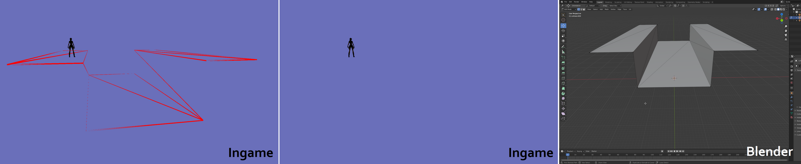

# Collision mesh

Each TerrainGroup can contain a collision mesh, this is a simple mesh used for the collision of the level. This mesh is not visible or has any textures.



The first member of the Mesh struct is m_box this is the border of your mesh, make sure to make it the same size of bigger than you vertice positions else the collision won’t work past its border. m_position is the position of the collision in the world.

To define the collision mesh use m_vertices and m_faces, the m_vertices points to an array of structs each for one vertice. The vertice consists of 3 x, y, z coordinates as int16. When adding faces make sure to update m_root faces count else your faces won’t work and you will fall trough your collision.

```cpp
struct Vertex
{
    int16_t x;
    int16_t y;
    int16_t z;
}

struct IndexedFace
{
    uint16_t i0; // 0-based face index
    uint16_t i1;
    uint16_t i2;
    int8_t adjacencyFlags;
    int8_t collisionFlags;
    int8_t clientFlags;
    int8_t materialType;
}
```