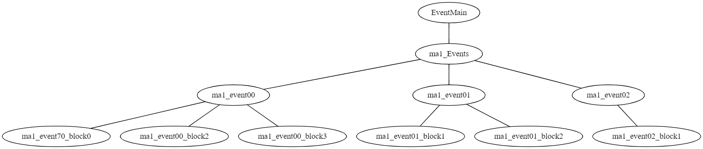

# Event

The event system is used to control the level flow, these consist of event blocks with logic e.g. querying a lever. In SR2 and later these events are stored as native code, before that they were stored as bytecode named ScriptPCode<sup>[1]</sup>. The event system was removed in Tomb Raider: Underworld.

The location where this native code is stored differs per platform, usually they are stored as executable (PE/DLL or ELF) in the level drm.

| Platform     | Description                             |
|--------------|-----------------------------------------|
| PC, PS2, PSP | Stored as PE/DLL files in the level drm |
| Wii          | Stored as ELF file in level drm (contains function symbols) |
| Mac          | Included in main executable together with game code (maybe cause Apple doesn't allow W^X?) |
| PS3          | Stored as SPRX file in seperate modules folder next to the game executable (eg.sprx, gr.sprx) |

## Exports

On most platforms the files where the event code is stored in expose several exports used by the game, such as.

* EventMain
* EventDebug
* EventRelocate
* CallTrigger
* IsTriggerActive

### EventMain

This is the function which is exposed to the game, the game will call this function every loop which will then call all events. The call structure is usually like this:



The prototype of EventMain is
```cpp
void EventMain(GameTracker* gameTracker, StreamUnit* unit, GlobalData* globalData)
```

globalData being an array of data and functions the events can call.

### EventDebug

This export exposes names for variables and eventvars of the level. It contains every eventvar used in the script and its index.

```cpp
struct EventVar
{
    char* name;
    int offset; // offset in the save eventvars array
};

struct UnsavedVar
{
    char* name;
    void* var; // pointer to the variable
};

struct EventDebug
{
	EventVar* eventVars // null terminated array
	UnsavedVar* unsavedVars // null terminated array
};
```

## Imports

When the executable is loaded all imports will be replaced with a function quiting the game with the error "Unrecognised imported function!" thus imports cannot be used.

## State

There are two types of  variables for events, event variables and unsaved variables. Unsaved variables are just variables initialized with default values when the assembly is loaded. Event variables instead are global between all levels and are saved in the savegame.

## Writing scripts

For platforms like PC where the native code can be easily replaced by recompiling a DLL and replacing the section you can write your own level flow. You can do so in any language which compiles to x86 like C/C\++ or Assembly, note though you cannot use WinAPI functions or anything requiring to link/import a dll (e.g. C++ standard library).

You don't have to adhere the orginal event structure since game only calls the EventMain function, though you must always export 2 symbols `EventMain` and `EventRelocate`.

```cpp
void EventMain(GameTracker* gameTracker, StreamUnit* unit, GlobalData* globalData)
{
	// called every gameloop, put your logic here
}

void EventRelocate()
{
	return;
}
```

You can put all your logic in EventMain and it will run every game loop.

## References

<sup>[1]</sup> AesirHod
