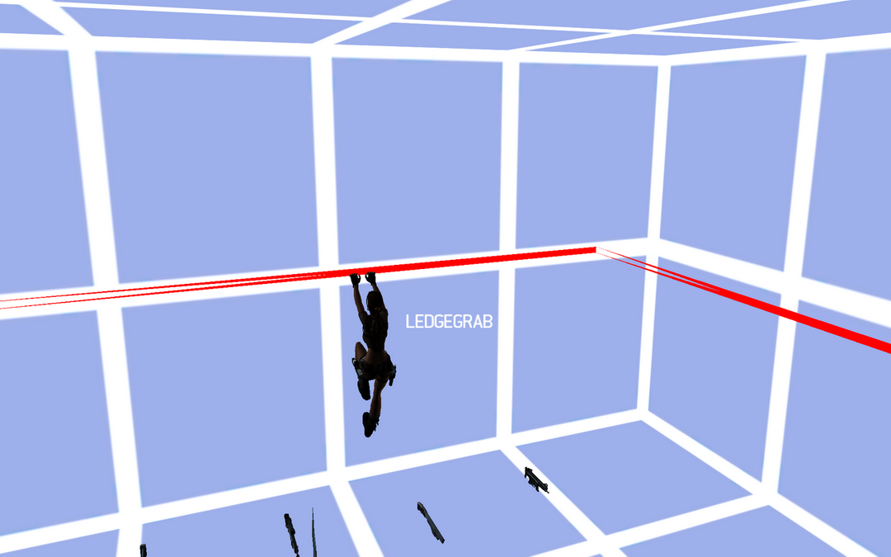
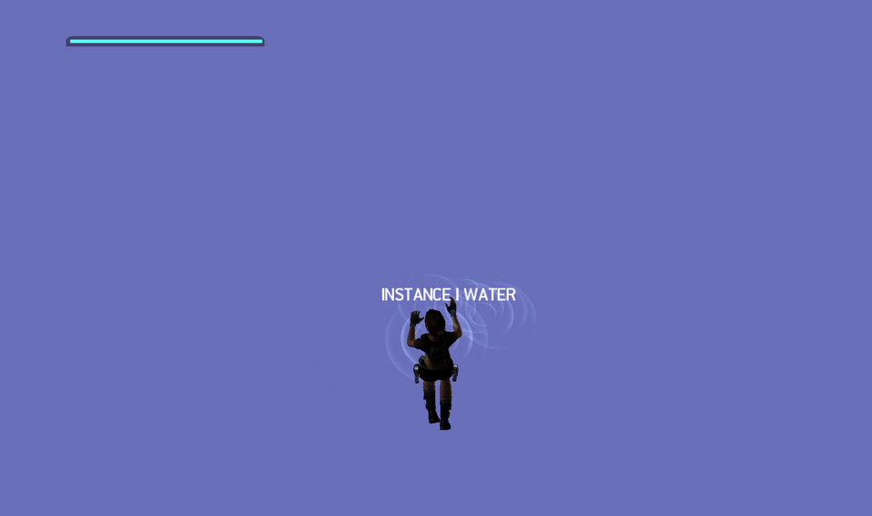

# MarkUp

MarkUp is used to mark spots in the level as stuff such as ledges, poles, ladders but also water.



## Legdes

Ledges are defined using MarkUp with flag `MUD_FLAG_LEDGEGRAB` and `MUD_FLAG_POLYLINE`, then the ledge is defined with a polyline.

## Water

Water works by having an intro with `watervolume` object and MarkUp with `MUD_FLAG_INSTANCE` and `MUD_FLAG_WATER` flags. The MarkUp will have the intro id of the water intro.
To define the size of your water set the bbox member in your markup to coordinates of both borders of your watervolume.



To add flowing water you need to set the `data` member of your water intro, point it to a struct where you put the `IntroData` structure.

```cpp
struct IntroData
{
    int type;
	// data
};
```

Type should be 13 for WaterVolumeIntroData. Now add your `WaterVolumeIntroData` data right after the `IntroData` struct, 4 members are important `flowRadius`, `waterDepth`, `waterInflow`, `waterOutflow`.

`waterDepth` is the height of the water, without WaterVolumeIntroData this will always be the highest point of your box but with the intro data you need to explicitly define it. +
`waterSpeed` is the speed of your flowing water.

To define from where to where the water should flow you need to add 2 extra intros, each of those intros need to be objectID `-6` and the position should be the position of your in/out flow. Now set the `waterInflow` and `waterOutflow` both to the intro number of your in/out flow intros. If you did all you should have flowing water from inFlow to outflow, as example also see [this](https://www.youtube.com/watch?v=b3sjmDiq8BE) video