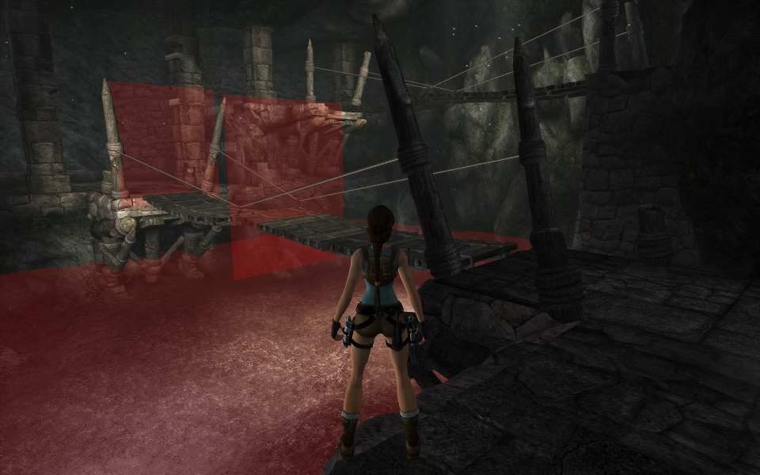
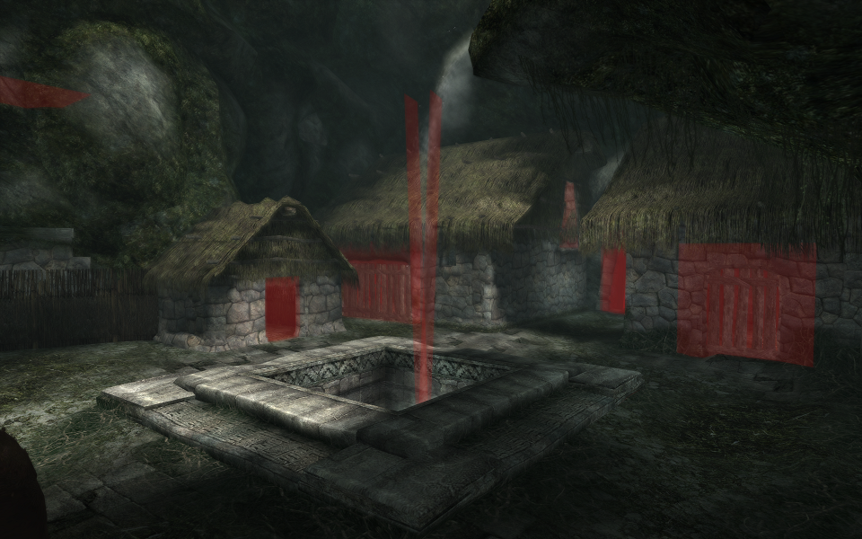

# Signals

Signals are mesh faces which trigger things when the player collides with them, this can be special camera angles but also triggering of events or attackwaves.




## Mesh

The collision mesh for the signals is at `terrain->signalTerrainGroup->mesh`, this is the same as the collision mesh except a little difference in the `IndexedFace` structure where the last 2 flags are now a 16-bit unsigned integer which is the index of the signal.

```cpp
struct SignalFace
{
	uint16_t i0;
	...
	char collisionFlags;
	uint16_t id; // index of the signal
};
```